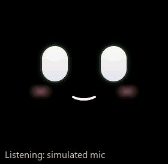
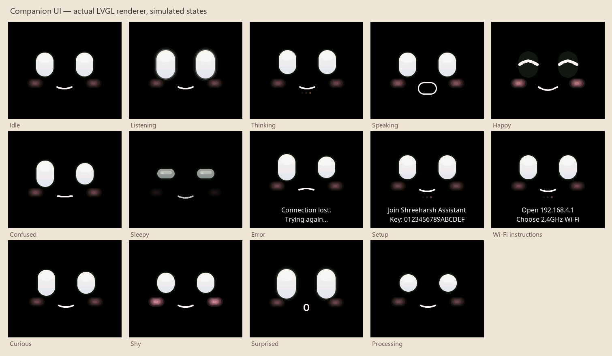
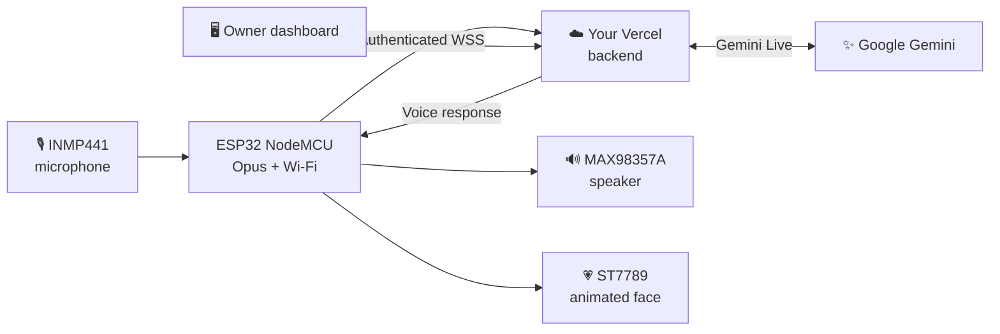
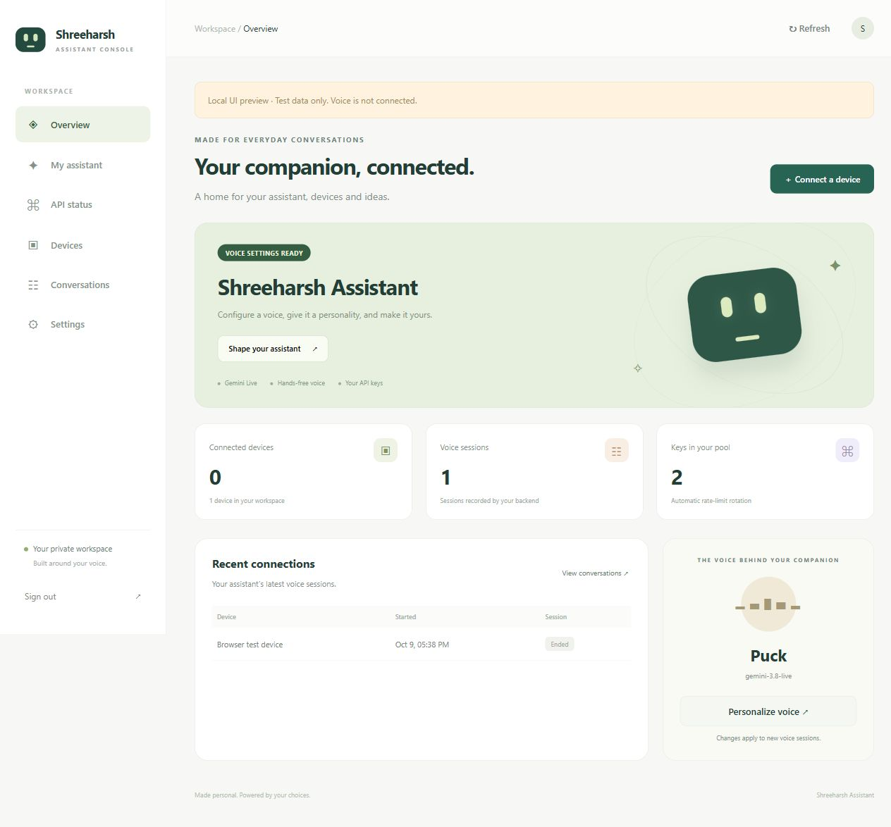

<div align="center">

# 🎙️ Shreeharsh Assistant
### Your voice. Your assistant. Your ESP32.

**A tiny AI companion with an expressive face, hands-free conversations and your own Gemini-powered backend.**




<br />

[](main/)
[](https://github.com/espressif/esp-idf)
[](main/boards/custom-esp32-nodemcu-pocket-ai/)
[](LICENSE)

**[See It in Action](#-meet-the-face) · [Features](#-features) · [Hardware](#-hardware-and-wiring) · [Get Started](#-getting-started) · [Backend](#-gemini-live--vercel-backend)**

<sub>The banner is illustrative. The animations below are rendered previews from the firmware's LVGL UI simulator; they are not footage of a fully validated physical device.</sub>

</div>

---

## 💗 Meet Shreeharsh Assistant

**Shreeharsh Assistant** is a personal open-source voice-assistant project for a **classic ESP32 NodeMCU / ESP32-WROOM-32**, combining an **ST7789 TFT display**, **INMP441 microphone**, **MAX98357A I²S amplifier**, and an editable **Vercel-hosted backend using Gemini Live**.

It is more than a status screen. The **280 × 240 landscape interface** is built around a friendly, minimalist face on a true black background. Its warm-white eyes blink and glance naturally, pink cheeks soften different expressions, and its mouth reacts to speech-output levels. The assistant is designed to start listening when Wi-Fi and your backend are ready, then listen again after finishing a reply.

**Your ESP32 handles the face, audio I/O and Wi-Fi. Your backend handles the cloud AI.** The Gemini API key is kept in private server environment variables—not in the ESP32 firmware, browser setup page or repository.

> [!IMPORTANT]
> This is an actively developed personal hardware project. The animated UI and local software tests are available, but **audible speaker playback and an end-to-end deployed Gemini conversation have not yet been validated on the device**. See [Current test status](#-current-test-status) before expecting a working assembled assistant.

## ✨ Meet the face

<div align="center">


**A little personality from the moment it wakes.**



**A lightweight, audio-reactive face.**



<sub>Generated from the project's LVGL rendering harness using synthetic audio/state data. See [UI design and validation](docs/pocket/COMPANION_UI.md).</sub>

</div>

### An expression for every moment

| Mode | Face behavior |
|---|---|
| **Idle** | Gentle breathing, occasional glances and naturally spaced blinks |
| **Listening** | Attentive eyes brighten and respond to microphone RMS |
| **Thinking** | Subtle motion, processing expressions and context captions |
| **Speaking** | Mouth animation follows successfully queued output PCM levels |
| **Happy / shy** | Softer expressions with increased pink blush |
| **Sleepy / curious** | Relaxed eyelids, changing gaze and small emotional reactions |
| **Connecting / error** | Clear state feedback without covering the face with a permanent debug UI |

These effects use fixed LVGL drawing objects—not heavy GIF decoding on the ESP32. Rendering is designed for a no-PSRAM board, with adaptive update intervals. **30 fps is a target during active animation, not a sustained device benchmark.** Mouth movement is amplitude-based, **not phoneme-level lip sync or proof of audible playback**.

Explore the [individual expression previews](docs/pocket/ui-preview/) and the [face renderer source](main/boards/custom-esp32-nodemcu-pocket-ai/face_renderer.cc).

## 🚀 Features

| | Feature | Details |
|:--:|---|---|
| 🎙️ | **Hands-free listening** | Automatically starts listening when the device is online and backend-ready; resumes after reply playback |
| 🧠 | **Gemini Live integration** | Custom backend translates voice traffic between the device's Opus stream and Gemini Live |
| 👀 | **Expressive animated UI** | Landscape face, pink cheeks, blinking, gaze and audio-responsive expressions |
| 🌐 | **Phone-based Wi-Fi setup** | Password-protected device hotspot and setup page at `http://192.168.4.1` |
| 🔊 | **Digital microphone and speaker** | Shared-clock I²S audio using INMP441 and MAX98357A |
| 🛡️ | **Private provider credentials** | Gemini keys belong in Vercel environment variables; device uses a separate token |
| 🖥️ | **Owner dashboard** | Assistant settings, device access, masked API status and optional encrypted transcript storage |
| 🧰 | **Diagnostics firmware** | Offline display/audio investigation with separate build and USB flashing modes |
| 🔄 | **Recovery logic** | Bounded attempts to reconnect and resume sessions following network/server interruptions |

<details>
<summary><b>How hands-free works (and what it cannot do yet)</b></summary>

The firmware automatically opens a listening session when connected. Microphone audio is sent to the backend, which uses Gemini Live for speech/turn handling. After a spoken reply drains, capture can start again.

**Not implemented:** on-device wake-word recognition, true simultaneous listening and speaking, voice interruption during playback, and persistent conversation memory across renewed Live sessions. Audio capture pauses during playback to avoid speaker feedback. See [hands-free technical guide](docs/pocket/HANDS_FREE.md).

</details>

## 🧩 System architecture



The project uses ESP-IDF firmware based on the MIT-licensed [XiaoZhi ESP32 upstream](https://github.com/78/xiaozhi-esp32), but **this build uses your own custom Vercel backend** rather than requiring a XiaoZhi account or activation code.

## 🔌 Hardware and wiring

### Parts

| Part | Purpose |
|---|---|
| **Classic ESP32 NodeMCU / ESP32-WROOM-32** | Main MCU; this board variant targets 4 MB flash with no PSRAM |
| **ST7789 240 × 280 SPI TFT** | Mounted/displayed in logical **280 × 240 landscape** |
| **INMP441 digital microphone** | I²S microphone input |
| **MAX98357A amplifier module** | I²S mono amplified output |
| **8 Ω mini speaker** | Voice playback; match power to the speaker's real rating |
| **USB data cable / verified USB power** | Programming and initial power |

### Connections for this firmware

These are **GPIO numbers** from [`config.h`](main/boards/custom-esp32-nodemcu-pocket-ai/config.h), not universal NodeMCU D-pin labels. Check the GPIO markings on your own board.

| Module signal | ESP32 connection |
|---|---|
| ST7789 VCC + BLK | **3V3** |
| ST7789 GND | **GND** |
| ST7789 SCL / SCK | **GPIO18** |
| ST7789 SDA / MOSI | **GPIO23** |
| ST7789 CS | **GPIO13** |
| ST7789 DC | **GPIO27** |
| ST7789 RES / RST | **GPIO14** |
| INMP441 VDD | **3V3** |
| INMP441 GND + L/R | **GND** |
| INMP441 SCK / BCLK | **GPIO26** |
| INMP441 WS / LRCLK | **GPIO25** |
| INMP441 SD (mic data) | **GPIO34** |
| MAX98357A VIN | **Verified USB-derived 5 V / VIN**, not an assumed power pin |
| MAX98357A GND | **GND** |
| MAX98357A BCLK | **GPIO26** (shared) |
| MAX98357A LRC | **GPIO25** (shared) |
| MAX98357A DIN | **GPIO22** |
| MAX98357A SD / SD_MODE | **Breakout-dependent enable bias**, see electrical notes |
| MAX98357A GAIN | **Leave unconnected** unless the module documentation calls for a safe alternative |
| Speaker + and − | **MAX98357A SPK+ and SPK− only** |

> [!CAUTION]
> **Check the electrical guide before power-on.** Never apply 5 V to the INMP441. Verify the NodeMCU's actual USB/VIN routing with a meter before using it as the amplifier supply. The amplifier's **SD enable pin is not the microphone's SD audio pin**. The speaker output is differential: **neither SPK terminal is ground**. There is no supported onboard battery charger in this classic NodeMCU setup.

Read: **[Complete wiring, amplifier bias and safety notes](docs/pocket/WIRING.md)**.

### Display orientation

The ST7789 glass is **240 × 280** natively; the firmware rotates its logical interface to **280 × 240**. To flip to the opposite landscape orientation, use the documented `POCKET_LANDSCAPE_FLIPPED` setting in [the board configuration](main/boards/custom-esp32-nodemcu-pocket-ai/config.h) and rebuild. The wiring stays the same. Display rotation and edge alignment still need to be checked on the real panel.

## 🛠️ Getting started

### Step 1 — Clone the project

```bash
git clone https://github.com/shreeharsh-patil/Esp-32-Node-MCU-Assistant.git
cd Esp-32-Node-MCU-Assistant
```

### Step 2 — Install and activate ESP-IDF

Use **ESP-IDF 6.1**. ESP-IDF 5.x / Arduino IDE is **not** the supported build environment. For example, in a Windows PowerShell environment configured for your installation:

```powershell
$env:IDF_TOOLS_PATH = 'D:\Espressif\tools'
$env:PYTHONUTF8 = '1'
. 'D:\Espressif\esp-idf-v6.1\export.ps1'
idf.py --version
```

Change these example paths to match your actual ESP-IDF installation. On Linux/macOS source your SDK's `export.sh`.

### Step 3 — Build conversation firmware

```powershell
python scripts/build.py custom-esp32-nodemcu-pocket-ai --name custom-esp32-nodemcu-pocket-ai
```

For **offline diagnostics** (no Wi-Fi or cloud sessions):

```powershell
python scripts/build.py custom-esp32-nodemcu-pocket-ai --name custom-esp32-nodemcu-pocket-ai-diagnostics
```

> [!TIP]
> **Choose the conversation build for Wi-Fi setup.** The diagnostic firmware disables Wi-Fi and the backend by design. Flashing diagnostics and then expecting a hotspot will not work.

### Step 4 — Flash over USB

Follow the [board build instructions](main/boards/custom-esp32-nodemcu-pocket-ai/README.md) to generate the matching image. For a prepared firmware image using the repository's guarded flashing script:

```powershell
python scripts/pocket_flash.py --port COM4
```

Replace `COM4` with the actual port on your machine. The normal update path is designed to preserve stored NVS configuration; use `--erase-all` only when an intentional reset/migration requires it.

**USB flashing is used for firmware updates. OTA firmware writing is disabled** in the documented 4 MB, single-application board configuration. The **BOOT (GPIO0)** button is a bootstrapping pin, so release it before normal startup.

## ☁️ Gemini Live + Vercel backend

<div align="center">


<sub>Locally tested dashboard preview, not a live production environment.</sub>
</div>

The repository includes an editable [Node.js/Express backend](backend/) that bridges the ESP32's authenticated WebSocket/Opus conversation stream to **Gemini Live**. The **dashboard** can configure assistant behavior, manage device access, and view conversation history with optional Neon PostgreSQL storage.

### Deployment overview

1. Follow the [backend deployment guide](backend/README.md) to deploy the `backend/` directory to your Vercel project.
2. Set the private Production environment variables for **Gemini access**, your **device token**, dashboard access, encryption, database and the **public backend origin** as described there.
3. Redeploy when environment variables are updated and verify the health/deployment checks in the backend guide.
4. Use the backend's stable **HTTPS production URL** and matching **device token** on the ESP32 setup page.

> [!WARNING]
> **Never commit or paste Gemini API keys, admin tokens or database credentials into firmware, GitHub documentation or the device setup form.** The device should receive only its backend HTTPS URL and its separate device authentication token. The dashboard reports Gemini provider status without offering secret-key entry.

The Vercel backend and a real Gemini Live session are still **deployment-dependent**; successful local tests do not mean a public backend has already been deployed. See [backend validation](backend/VALIDATION.md) and [dashboard guide](backend/DASHBOARD.md).

## 📶 Connect the ESP32 to Wi-Fi

Use the **conversation firmware** and follow the actual instructions on the display:

1. On your phone, join the protected Wi-Fi hotspot **Shreeharsh Assistant**.
2. Enter the **hotspot password shown on the ESP32 display**.
3. Open **http://192.168.4.1** in your browser; choose to stay connected if the phone warns that the hotspot has no internet.
4. Enter your **2.4 GHz Wi-Fi** details, **Vercel HTTPS origin** and **device token**.
5. Wait for the on-screen **Connected** state and local IP address. Rejoin your normal Wi-Fi.
6. When both Wi-Fi and backend are ready, the conversation firmware is designed to start listening automatically.

**Wi-Fi not connecting?** Check that your router offers 2.4 GHz, the hotspot is the conversation firmware's hotspot, the entered credentials are correct and the device reaches a real DHCP-assigned IP. Refer to [display and Wi-Fi fixes](docs/pocket/DISPLAY_WIFI_FIX.md).

## 🎮 Controls and useful commands

| Control | Behavior |
|---|---|
| **Hands-free (default)** | Listen when connected; restart after reply playback |
| **BOOT button / optional PTT** | Manual interaction; release BOOT before reset or flashing |
| `handsfree off` | Pause automatic capture (serial command) |
| `handsfree on` | Resume automatic capture (serial command) |
| `setup` | Reopen the Wi-Fi/backend setup page |
| `wifi-reset CONFIRM` | Clear Wi-Fi credentials intentionally |
| `diag` | Print device/audio/UI diagnostics via serial |
| `face NAME` | Preview supported face expressions while idle |
| `tone` / `testaudio` | Local speaker/audio diagnostics when the appropriate test mode allows them |

### Separate offline diagnostics

```powershell
python scripts/pocket_flash.py --port COM4 --diagnostics
```

This diagnostic variant is for hardware investigation; it **cannot** connect to Gemini. Flash the conversation firmware again to use the phone setup flow.

## 🧪 Current test status

Based on the repository's [hardware](docs/pocket/HARDWARE_TESTS.md), [UI](docs/pocket/UI_VALIDATION.json), and [backend](backend/VALIDATION.md) validation records:

| Area | Current evidence |
|---|---|
| **Firmware build** | Conversation and diagnostic variants have built in the recorded project validation |
| **Animated face** | Firmware-rendered previews pass host checks; the black-background, white-eye/pink-cheek interface was observed on a device |
| **Wi-Fi startup** | Setup hotspot observed; current provisioning and reconnection require further real-device acceptance |
| **Digital audio transport** | I²S/Opus frames transferred in local tests; DMA overruns were observed and need investigation |
| **Speaker output** | **Not working audibly in recorded retests** despite transmitted tone/replay frames |
| **Backend unit/integration tests** | Locally tested, including device authentication and protocol paths |
| **Live Gemini + deployed Vercel** | **Not verified** as a working production voice conversation |
| **Long-duration stability** | Pending physical soak/endurance tests |

> [!NOTE]
> **An animated mouth does not prove the speaker is producing sound.** Do not increase amplifier gain or volume to compensate without first checking supply voltage, SD/MODE behavior, wiring and safe output power. If you're building the physical device, begin with the [hardware acceptance checklist](docs/pocket/HARDWARE_TESTS.md).

## 📁 Project structure

```text
.
├── main/
│   └── boards/custom-esp32-nodemcu-pocket-ai/
│       ├── config.h                 # ESP32 GPIO and display orientation
│       ├── config.json              # Conversation + diagnostic build variants
│       ├── face_animation.h         # Lightweight expression timing logic
│       ├── face_renderer.cc         # Minimal LVGL face
│       ├── pocket_audio_codec.cc    # Shared-clock I2S audio
│       ├── pocket_wifi.cc           # Phone setup and network handling
│       └── pocket_board.cc          # Board integration
├── backend/
│   ├── src/                     # Gemini bridge and backend services
│   ├── public/                  # Dashboard frontend
│   ├── tests/                   # Backend tests
│   └── README.md                # Deployment instructions
├── docs/pocket/
│   ├── ui-preview/              # Rendered face animations and states
│   ├── COMPANION_UI.md          # UI architecture and constraints
│   ├── WIRING.md                # Complete electrical pinout
│   ├── HANDS_FREE.md            # Hands-free behavior
│   └── HARDWARE_TESTS.md        # Physical acceptance plan
├── scripts/                     # Build, flashing and validation tools
└── README.md
```

## 📚 Documentation

- **[Board integration and build guide](main/boards/custom-esp32-nodemcu-pocket-ai/README.md)** — target, flashing, firmware variants and internals
- **[Hardware wiring and safety](docs/pocket/WIRING.md)** — pin mapping, voltage and amplifier checks
- **[Face animation and LVGL design](docs/pocket/COMPANION_UI.md)** — UI behavior, memory budget, animations and preview generation
- **[Wi-Fi setup and troubleshooting](docs/pocket/DISPLAY_WIFI_FIX.md)** — hotspot and connection flow
- **[Backend and Gemini Live](backend/README.md)** — deployment and service configuration
- **[Owner dashboard](backend/DASHBOARD.md)** — assistant settings, devices and history
- **[Hardware test checklist](docs/pocket/HARDWARE_TESTS.md)** — what's tested, what remains

---

## 🧑‍💻 Project and license

This is a **personal project** maintained by **[Shreeharsh Patil](https://github.com/shreeharsh-patil)**. **Outside contributions, pull requests and feature requests are not being accepted.**

The repository contains code derived from the MIT-licensed [XiaoZhi ESP32](https://github.com/78/xiaozhi-esp32) project. See [LICENSE](LICENSE) and [third-party notices](docs/pocket/THIRD_PARTY_NOTICES.md) for attribution.

Looking for the smaller, different-board version? Explore **[Seeed Studio XIAO ESP32-S3 Pocket Mini](https://github.com/shreeharsh-patil/Seeed-studio-XIAO-ESP32--S3-Pocket-Mini)**.

<div align="center">

### A little companion with a lot of character. 💗

**Built with ESP32 · LVGL · I²S · Vercel · Gemini Live**

⭐ **Star this project** if you like expressive embedded interfaces.

</div>
